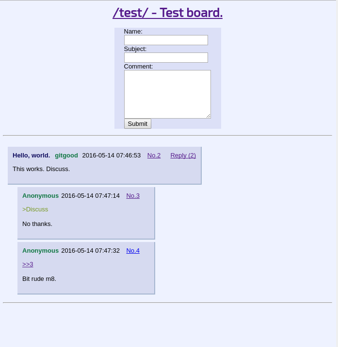

#Textboard



A small texboard written in PHP. 

## Todo

* Add table creation to PHP. Here is the database needed:

```
SET SQL_MODE = "NO_AUTO_VALUE_ON_ZERO";
SET time_zone = "+00:00";


CREATE TABLE `comments` (
  `id` int(11) NOT NULL,
  `thread_id` int(11) DEFAULT NULL,
  `subject` varchar(30) DEFAULT NULL,
  `comment` longtext NOT NULL,
  `isThread` tinyint(4) NOT NULL,
  `date` timestamp NOT NULL DEFAULT CURRENT_TIMESTAMP ON UPDATE CURRENT_TIMESTAMP,
  `name` varchar(20) DEFAULT NULL
) ENGINE=InnoDB DEFAULT CHARSET=latin1;


CREATE TABLE `users` (
  `id` int(11) NOT NULL,
  `username` varchar(30) NOT NULL,
  `password` varchar(100) NOT NULL
) ENGINE=InnoDB DEFAULT CHARSET=latin1;


ALTER TABLE `comments`
  ADD PRIMARY KEY (`id`);

ALTER TABLE `users`
  ADD PRIMARY KEY (`id`);


ALTER TABLE `comments`
  MODIFY `id` int(11) NOT NULL AUTO_INCREMENT, AUTO_INCREMENT=1;

ALTER TABLE `users`
  MODIFY `id` int(11) NOT NULL AUTO_INCREMENT, AUTO_INCREMENT=1;

```

* Add more admin features.

* Add more boards.

* More Javascript.

* Improve styling.